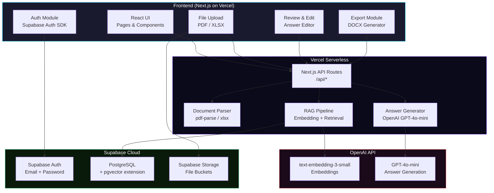
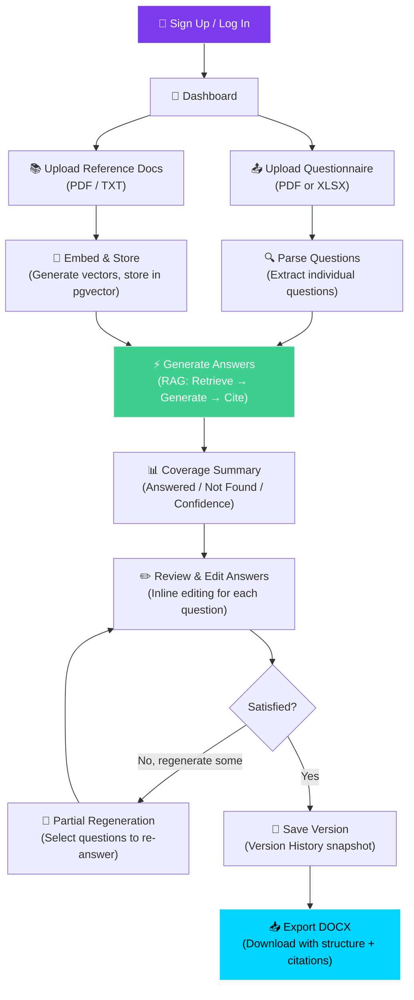
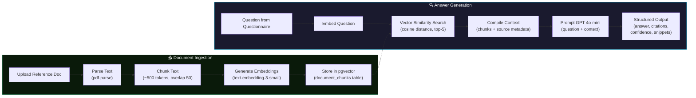
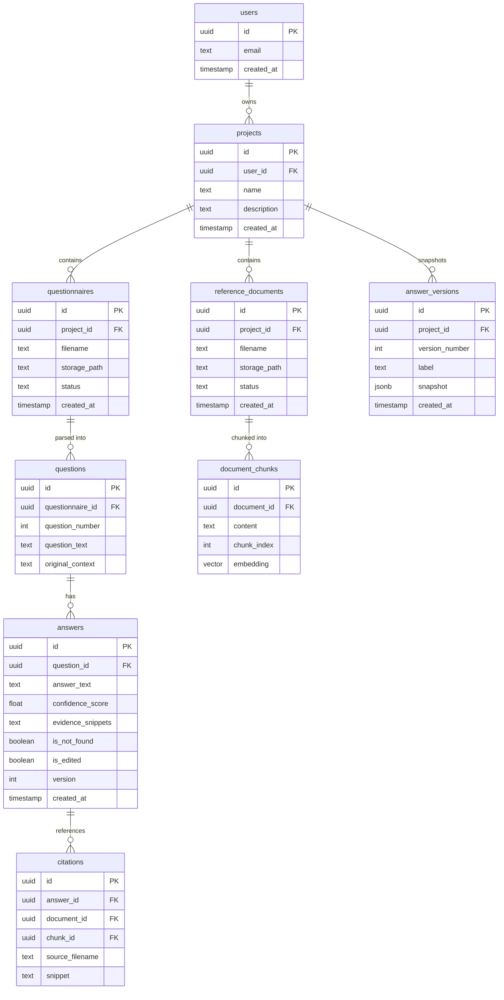
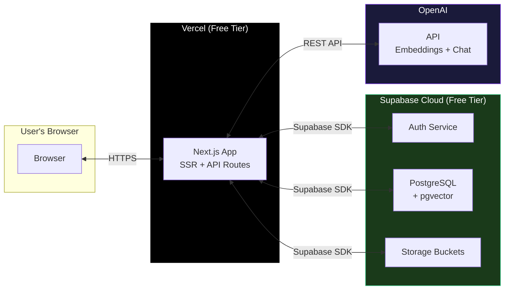

# Structured Questionnaire Answering Tool — Implementation Plan

> **Assignment:** GTM Engineering Internship — Take-Home  
> **Goal:** Build an AI-powered tool that automates answering structured questionnaires using internal reference documents, with citations, editing, export, and all 5 nice-to-have features.

---

## 1. What We Are Building

A **full-stack, AI-powered Structured Questionnaire Answering Tool** that lets users:

1. **Sign up / Log in** (authentication)
2. **Upload a questionnaire** (PDF or XLSX) containing 8–15 structured questions
3. **Upload reference documents** (PDF/text) that act as the "source of truth"
4. **Generate AI answers** grounded in the reference documents, each with citations
5. **Review and edit** answers before exporting
6. **Export** a downloadable document preserving the original structure
7. Benefit from **all 5 nice-to-have features**: Confidence Scores, Evidence Snippets, Partial Regeneration, Version History, and Coverage Summary

---

## 2. Fictional Company & Industry

| Field | Value |
|---|---|
| **Industry** | SaaS / Cloud Security |
| **Company Name** | ShieldSync Inc. |
| **Description** | ShieldSync is a cloud-native security posture management (CSPM) platform that helps mid-market enterprises monitor, assess, and remediate security risks across AWS, Azure, and GCP workloads. Founded in 2022, ShieldSync serves 150+ customers and holds SOC 2 Type II and ISO 27001 certifications. |

**Questionnaire:** A 12-question vendor security assessment (typical of enterprise procurement)  
**Reference Documents:** 5 internal docs — Security Policy, Data Handling Policy, Incident Response Plan, Infrastructure Overview, and Compliance Certifications Summary.

---

## 3. Architecture Overview

### 3.1 System Architecture Diagram



### 3.2 User Flow Diagram



### 3.3 RAG Pipeline Detail



### 3.4 Database Schema Diagram



---

## 4. Technology Stack

| Layer | Technology | Rationale |
|---|---|---|
| **Frontend** | Next.js 14 (App Router) + TypeScript | React-based, SSR, API routes built-in, deploys natively to Vercel |
| **Styling** | Tailwind CSS v3 | Rapid, utility-first styling; excellent for polished UI |
| **Authentication** | Supabase Auth (email/password) | Zero-config, works with Supabase RLS, free tier sufficient |
| **Database** | Supabase PostgreSQL + pgvector | Serverless Postgres, vector similarity search for RAG, free tier |
| **File Storage** | Supabase Storage | S3-compatible, integrated with auth, easy file management |
| **AI / LLM** | OpenAI GPT-4o-mini | Cost-effective, excellent for structured Q&A generation |
| **Embeddings** | OpenAI text-embedding-3-small | 1536-dim, fast, cheap, great retrieval quality |
| **PDF Parsing** | pdf-parse (npm) | Lightweight, server-side PDF text extraction |
| **XLSX Parsing** | xlsx (SheetJS) | Industry-standard spreadsheet parsing |
| **DOCX Export** | docx (npm) | Programmatic Word document generation |
| **Deployment** | Vercel (frontend + API) + Supabase Cloud (DB + Auth + Storage) | Full serverless, zero-ops, free tiers available |

---

## 5. Deployment Architecture



### Deployment Details

| Service | Platform | Tier | Cost |
|---|---|---|---|
| Frontend + API Routes | **Vercel** | Hobby (Free) | $0 |
| Database (PostgreSQL + pgvector) | **Supabase** | Free | $0 |
| Authentication | **Supabase Auth** | Free (50k MAU) | $0 |
| File Storage | **Supabase Storage** | Free (1GB) | $0 |
| AI API | **OpenAI** | Pay-as-you-go | ~$0.50–2.00 for demo |

> **Total estimated cost for a demo: < $5**

---

## 6. Execution Phases

### Phase 0: Project Setup (This document)
- Documentation, planning, and architecture design

### Phase 1: Initialize Project & Infrastructure
- `npx create-next-app` with TypeScript + Tailwind
- Set up Supabase project (via MCP or dashboard)
- Enable `pgvector` extension
- Configure environment variables
- Create project folder structure

### Phase 2: Authentication
- Supabase Auth integration (sign up, login, logout)
- Protected route middleware
- Auth UI pages with polished design

### Phase 3: Database Schema & Storage
- Run all migrations (tables per ER diagram above)
- Set up RLS policies for multi-tenant security
- Configure Supabase Storage buckets (questionnaires, references)

### Phase 4: Core Workflow
- **Upload flow**: Questionnaire upload + reference doc upload
- **Parsing**: Extract questions from PDF/XLSX
- **Embedding pipeline**: Chunk reference docs → embed → store in pgvector
- **RAG retrieval**: Vector similarity search for each question
- **Answer generation**: GPT-4o-mini with structured output
- **Web view**: Display Question → Answer → Citations

### Phase 5: Review & Export
- Inline answer editing
- DOCX export with preserved structure and citations

### Phase 6: Nice-to-Have Features (All 5)
1. **Confidence Score** — cosine similarity avg from retrieval, displayed as badge
2. **Evidence Snippets** — show relevant text chunks from reference docs
3. **Partial Regeneration** — checkbox to select questions, re-run RAG for selected only
4. **Version History** — snapshot answers as JSON, compare versions side-by-side
5. **Coverage Summary** — dashboard header: total, answered, not-found, avg confidence

### Phase 7: Sample Data, README & Deployment
- Create fictional company data files
- Write comprehensive README
- Deploy to Vercel + verify Supabase production
- Final QA on live link

---

## 7. Feature Matrix

| Feature | Phase | Priority | Status |
|---|---|---|---|
| User Authentication (signup/login) | 2 | Must Have | Planned |
| Questionnaire Upload (PDF/XLSX) | 4 | Must Have | Planned |
| Reference Document Upload | 4 | Must Have | Planned |
| Question Parsing | 4 | Must Have | Planned |
| RAG Retrieval (pgvector) | 4 | Must Have | Planned |
| AI Answer Generation with Citations | 4 | Must Have | Planned |
| Structured Web View | 4 | Must Have | Planned |
| Answer Review & Edit | 5 | Must Have | Planned |
| DOCX Export | 5 | Must Have | Planned |
| Confidence Score | 6 | Nice-to-Have | Planned |
| Evidence Snippets | 6 | Nice-to-Have | Planned |
| Partial Regeneration | 6 | Nice-to-Have | Planned |
| Version History | 6 | Nice-to-Have | Planned |
| Coverage Summary | 6 | Nice-to-Have | Planned |

---

## 8. Project File Structure

```
structured-questionnaire-tool/
├── public/
│   └── ...
├── src/
│   ├── app/
│   │   ├── layout.tsx              # Root layout with providers
│   │   ├── page.tsx                # Landing / redirect
│   │   ├── login/
│   │   │   └── page.tsx            # Login page
│   │   ├── signup/
│   │   │   └── page.tsx            # Sign up page
│   │   ├── dashboard/
│   │   │   └── page.tsx            # Project list dashboard
│   │   ├── project/
│   │   │   └── [id]/
│   │   │       ├── page.tsx        # Project detail & answer view
│   │   │       ├── upload/
│   │   │       │   └── page.tsx    # Upload questionnaire + refs
│   │   │       ├── review/
│   │   │       │   └── page.tsx    # Review & edit answers
│   │   │       └── history/
│   │   │           └── page.tsx    # Version history
│   │   └── api/
│   │       ├── auth/
│   │       │   └── callback/
│   │       │       └── route.ts    # Supabase auth callback
│   │       ├── parse/
│   │       │   └── route.ts        # Parse questionnaire
│   │       ├── embed/
│   │       │   └── route.ts        # Embed reference docs
│   │       ├── generate/
│   │       │   └── route.ts        # Generate answers (RAG)
│   │       ├── regenerate/
│   │       │   └── route.ts        # Partial regeneration
│   │       ├── export/
│   │       │   └── route.ts        # DOCX export
│   │       └── versions/
│   │           └── route.ts        # Version history CRUD
│   ├── components/
│   │   ├── ui/                     # Reusable UI components
│   │   ├── auth/                   # Auth-related components
│   │   ├── upload/                 # File upload components
│   │   ├── answers/                # Answer display & edit
│   │   └── dashboard/              # Dashboard components
│   ├── lib/
│   │   ├── supabase/
│   │   │   ├── client.ts           # Browser Supabase client
│   │   │   ├── server.ts           # Server Supabase client
│   │   │   └── middleware.ts       # Auth middleware
│   │   ├── openai.ts               # OpenAI client
│   │   ├── parser.ts               # PDF/XLSX parsing utils
│   │   ├── chunker.ts              # Text chunking logic
│   │   ├── rag.ts                  # RAG pipeline logic
│   │   └── export.ts               # DOCX generation
│   ├── types/
│   │   └── index.ts                # TypeScript type definitions
│   └── styles/
│       └── globals.css             # Global styles + Tailwind
├── sample-data/
│   ├── questionnaire.pdf           # Sample questionnaire
│   ├── security-policy.pdf         # Reference doc 1
│   ├── data-handling-policy.pdf    # Reference doc 2
│   ├── incident-response-plan.pdf  # Reference doc 3
│   ├── infrastructure-overview.pdf # Reference doc 4
│   └── compliance-certs.pdf        # Reference doc 5
├── .env.local                      # Environment variables
├── next.config.js
├── tailwind.config.ts
├── tsconfig.json
├── package.json
└── README.md
```

---

## 9. API Route Design

| Method | Route | Description |
|---|---|---|
| POST | `/api/auth/callback` | Supabase auth callback handler |
| POST | `/api/parse` | Upload & parse questionnaire into questions |
| POST | `/api/embed` | Chunk and embed reference documents |
| POST | `/api/generate` | Run RAG pipeline, generate answers for all questions |
| POST | `/api/regenerate` | Re-generate answers for selected question IDs |
| POST | `/api/export` | Generate and download DOCX file |
| GET | `/api/versions?projectId=X` | List answer versions for a project |
| POST | `/api/versions` | Save a new answer version snapshot |

---

## 10. Key Design Decisions & Trade-offs

| Decision | Rationale | Trade-off |
|---|---|---|
| **Next.js API Routes** instead of separate backend | Single deployment on Vercel, simpler infra | Serverless cold starts (mitigated by edge runtime where possible) |
| **Supabase pgvector** instead of Pinecone/Weaviate | Free, integrated with the DB, no extra service | Slightly less optimized for massive vector datasets (fine for demo scale) |
| **GPT-4o-mini** instead of GPT-4o | 90% cheaper, fast, sufficient quality for structured Q&A | Slightly lower reasoning quality (acceptable for grounded answers) |
| **Client-side Supabase SDK** for auth + storage | Simplified architecture, direct uploads | Requires proper RLS policies for security |
| **DOCX export** instead of PDF | Easier to edit, preserves structure, standard for business | Less universal than PDF (but explicitly matches assignment needs) |
| **All 5 nice-to-have features** | Demonstrates full capability and ambition | Increases scope — mitigated by clean architecture |

---

## 11. Proposed Changes Summary

### [NEW] Next.js Project
All files under `c:\Users\Admin\Desktop\Structured Questionnaire Answering Tool\` — initialized via `npx create-next-app`.

### Supabase Configuration
- Create Supabase project via MCP tools
- Enable pgvector extension
- Apply migrations for all tables (users rely on Supabase Auth, other 8 tables created)
- Configure RLS policies
- Create storage buckets: `questionnaires`, `references`

### Key Files

#### [NEW] [layout.tsx](file:///c:/Users/Admin/Desktop/Structured%20Questionnaire%20Answering%20Tool/src/app/layout.tsx)
Root layout with Supabase auth provider, global styles, fonts.

#### [NEW] [login/page.tsx](file:///c:/Users/Admin/Desktop/Structured%20Questionnaire%20Answering%20Tool/src/app/login/page.tsx)
Login page with email/password form, Supabase Auth integration.

#### [NEW] [signup/page.tsx](file:///c:/Users/Admin/Desktop/Structured%20Questionnaire%20Answering%20Tool/src/app/signup/page.tsx)
Sign up page with registration form.

#### [NEW] [dashboard/page.tsx](file:///c:/Users/Admin/Desktop/Structured%20Questionnaire%20Answering%20Tool/src/app/dashboard/page.tsx)
Main dashboard listing user's projects, with "New Project" CTA.

#### [NEW] [project/[id]/page.tsx](file:///c:/Users/Admin/Desktop/Structured%20Questionnaire%20Answering%20Tool/src/app/project/%5Bid%5D/page.tsx)
Project detail page showing coverage summary, upload status, and answer list.

#### [NEW] [api/generate/route.ts](file:///c:/Users/Admin/Desktop/Structured%20Questionnaire%20Answering%20Tool/src/app/api/generate/route.ts)
Core RAG pipeline: embed question → vector search → compile context → call LLM → return structured answers.

#### [NEW] [api/export/route.ts](file:///c:/Users/Admin/Desktop/Structured%20Questionnaire%20Answering%20Tool/src/app/api/export/route.ts)
DOCX generation using the `docx` npm package, preserving questionnaire structure.

#### [NEW] [lib/rag.ts](file:///c:/Users/Admin/Desktop/Structured%20Questionnaire%20Answering%20Tool/src/lib/rag.ts)
RAG utilities: embedding, chunking, similarity search, context compilation.

#### [NEW] [README.md](file:///c:/Users/Admin/Desktop/Structured%20Questionnaire%20Answering%20Tool/README.md)
Project documentation covering what was built, assumptions, trade-offs, improvement ideas.

---

## 12. Verification Plan

### Automated / Browser-Based Testing
Since this is a full-stack application with UI, the primary verification will be end-to-end browser testing:

1. **Auth Flow Test** — Open browser → Navigate to `/signup` → Create account → Verify redirect to dashboard → Log out → Log in again → Verify session persistence
2. **Upload Flow Test** — Log in → Create project → Upload sample questionnaire PDF → Upload sample reference docs → Verify files appear in project view
3. **Generation Test** — Click "Generate Answers" → Wait for completion → Verify all questions have answers with citations → Check "Not found" for unmatched questions
4. **Edit & Export Test** — Edit an answer inline → Save → Export DOCX → Download and verify structure
5. **Nice-to-Have Tests**:
   - Verify confidence scores display as color-coded badges
   - Verify evidence snippets are expandable
   - Select 2 questions → Click "Regenerate Selected" → Verify only those answers change
   - Save version → Generate new answers → Compare versions
   - Coverage summary shows correct counts

### Manual Verification
- **Live Link Verification**: Deploy to Vercel → Open live URL → Complete full user flow
- **Cross-browser**: Test in Chrome and Firefox
- **Responsive**: Verify layout on desktop and mobile viewports

> [!IMPORTANT]
> The user should provide an **OpenAI API key** for the AI features to work. This will be set as an environment variable (`OPENAI_API_KEY`) in both local `.env.local` and Vercel environment settings.

---

## 13. Environment Variables Required

```env
# Supabase
NEXT_PUBLIC_SUPABASE_URL=https://xxx.supabase.co
NEXT_PUBLIC_SUPABASE_ANON_KEY=eyJ...
SUPABASE_SERVICE_ROLE_KEY=eyJ...

# OpenAI
OPENAI_API_KEY=sk-...
```
